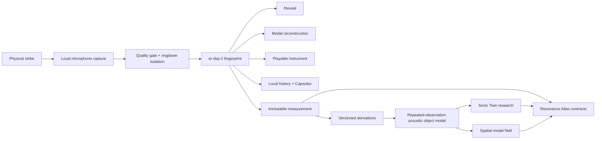

<div align="center">

# EVERYTHING RINGS

### Hit anything. Discover how it rings.

**A local-first acoustic instrument that turns one physical strike into an interpretable resonance model, a playable instrument, and a shareable acoustic artifact.**

[**Open the live instrument →**](https://fraware.github.io/EVERYTHING-RINGS/) · [Product principles](docs/PRODUCT.md) · [Science & DSP](docs/DSP.md) · [Full architecture](docs/ENGINEERING_TAKEOVER_AND_FULL_VISION_SPEC.md)

[](https://github.com/fraware/EVERYTHING-RINGS/actions/workflows/ci.yml)
[](https://github.com/fraware/EVERYTHING-RINGS/actions/workflows/digital-twin-qualification.yml)
[](https://github.com/fraware/EVERYTHING-RINGS/actions/workflows/full-vision-software-qualification.yml)
[](https://github.com/fraware/EVERYTHING-RINGS/actions/workflows/atlas-production-conformance.yml)
[](LICENSE)
[](tsconfig.base.json)

</div>

---

## One strike. A whole instrument.

A glass, bowl, bell, mug, plate, tool, or any other safe object has an audible ring shaped by the transient you record. EVERYTHING RINGS captures that strike in the browser, isolates the ringdown, estimates the resonant structure supported by the recording, reconstructs it, and turns the result into something you can **see, hear, play, save, compare, and share**.

The first-use loop is intentionally simple:

<div align="center">

### **STRIKE → REVEAL → HEAR → PLAY → SHARE**

</div>

Underneath that interaction is a much stricter system: deterministic DSP, native-rate acquisition, explicit quality gates, content-addressed provenance, frozen empirical contracts, synthetic qualification, research-only identity/material models, and an emerging Resonance Atlas architecture.

## Try it in 60 seconds

1. Open the [live instrument](https://fraware.github.io/EVERYTHING-RINGS/) on a microphone-enabled browser.
2. Tap **START LISTENING** and allow microphone access.
3. Use a safe object and make one clean strike near the microphone.
4. Explore the revealed modes, listen to the reconstructed model, and play the object chromatically.
5. Save the fingerprint locally or share an Acoustic Capsule without uploading microphone PCM.

> **Privacy by design:** raw microphone PCM stays local under the current product contract. Local history stores fingerprints, and Acoustic Capsules carry bounded fingerprint data in the URL fragment—not recordings.

## What a strike becomes

| Surface | What it gives you |
|---|---|
| **Acoustic DNA** | A deterministic visual identity for one measured fingerprint |
| **Resonance Microscope** | Per-mode frequencies, decay, confidence, and isolated audition |
| **Ringdown Lens** | A time-domain view of fitted modal envelopes |
| **CAPTURE ↔ MODEL** | Local comparison between the isolated ringdown and modal reconstruction |
| **Playable instrument** | Chromatic modal synthesis that preserves the measured frequency ratios and decay constants |
| **Saved captures** | Fingerprint-only local history that can be reopened without microphone access |
| **Resonance Diff** | Descriptive comparison of two capture observations without an identity verdict |
| **Acoustic Capsules** | Fingerprint-only interactive share links: hear it, play it, then try your own |
| **Acoustic Story** | A self-contained fingerprint-derived sound-and-motion artifact |

## From a strike to the long-term vision



The architectural rule is simple and important:

> **A capture is one observation. A fingerprint is one analysis of that observation. Neither is automatically the physical object.**

That distinction is what allows the repository to grow from a playful instrument into serious measurement, retrieval, and corpus infrastructure without turning a convenient hash into an unsupported scientific claim.

## Why this repository is unusual

### Deterministic first

The evidence-eligible baseline is explicit and inspectable. The canonical `er-dsp-2` path estimates peaks, tracks persistent modes, fits decay, computes confidence, and emits a versioned fingerprint. Research estimators live on separate non-evidence paths until a future algorithm earns promotion.

### Local-first by default

Microphone PCM is not required for sharing, saved-capture playback, Resonance Diff, Twin demos, or Atlas contracts. A future network service must justify any remotely stored data instead of making upload the default architecture.

### Measurement is separate from derivation

The validation layer content-addresses immutable measurements independently from renderers, instruments, similarity systems, visualizations, embeddings, and Atlas artifacts. Multi-source derivation records and source links let downstream research evolve without rewriting measurement history.

### Claims have maturity, not vibes

Capabilities move through an explicit ladder:

`prototype → software-qualified → synthetic-qualified → physical-research → held-out-validated → product-eligible → released`

A green workflow cannot promote a synthetic result into physical evidence. The [claim registry](docs/CLAIM_REGISTRY.md) records the strongest proposition currently earned for each capability.

## Current capability map

| Capability | Current maturity | Scope |
|---|---|---|
| Consumer **STRIKE → REVEAL → HEAR → PLAY** | **software-qualified** | Browser and synthetic qualification |
| Resonance estimation (`er-dsp-2`) | **software-qualified** | Estimated audible resonances supported by a recorded transient |
| Modal reconstruction + playable instrument | **software-qualified** | Deterministic fingerprint-derived audio |
| Sonic Twin retrieval / verification | **synthetic-qualified** | Named digital populations only |
| Spatial modal-field prediction | **software-qualified** | Predicted fingerprints; never measurement evidence |
| Material inference | **prototype / research** | No calibrated physical material claim |
| Measurement + derivation provenance | **software-qualified** | Content-addressed V1 measurements and V2 multi-source derivations |
| Atlas V1/V2 integrity contracts | **software-qualified** | Records, snapshots, public observations, specimen records, membership assertions |
| Atlas client + local file-backed HTTP API | **software-contract qualified** | Local/durable software path; not a public production network |
| Empirical Gate A2 / B / C | **not yet run** | Frozen physical/perceptual sequence remains separate |

The authoritative wording and exclusions live in [`docs/CLAIM_REGISTRY.md`](docs/CLAIM_REGISTRY.md).

## The research stack

The post-freeze software line already contains foundations for the larger research program:

- repeated-observation `AcousticObjectModelV1` estimates with frequency/decay/amplitude dispersion and observation support;
- nuisance characterization across strike, support, room, station, operator, and day;
- specimen-disjoint benchmark construction and hard-negative selection;
- deterministic Sonic Twin verification with `match / nonmatch / abstain`;
- ranked specimen retrieval with Recall@K and MRR;
- group-disjoint isotonic probability calibration with Brier score, calibration error, ROC AUC, and risk/coverage analysis;
- explicit similarity-algorithm promotion policy;
- spatial modal sound fields with strike-location-conditioned excitation;
- research-only high-resolution modal estimation and material inference;
- station qualification contracts;
- content-addressed measurement, derivation, artifact-envelope, Atlas, and assurance contracts;
- Atlas V2 observation/specimen/membership semantics;
- a typed Atlas client and local file-backed HTTP service with conformance, HTTP, persistence, and V2 tests;
- an independent verification CLI for exact-byte hashing and artifact/evidence validation.

The interactive research surfaces are deliberately labeled synthetic:

- `?twin=1` — Sonic Twin software lab;
- `?atlas=1` — local Resonance Atlas software lab;
- `?lab=1` — validation/review lab.

They are research and qualification surfaces, not product claims about physical identity.

## Repository map

```text
EVERYTHING-RINGS/
├── apps/
│   ├── web/                 # consumer instrument + empirical/research surfaces
│   └── atlas-api/           # local/durable Atlas HTTP service contracts
├── packages/
│   ├── acquisition/         # microphone acquisition + capture quality
│   ├── dsp/                 # canonical DSP + research estimators
│   ├── fingerprint/         # recurrence, object models, Twin, calibration, material/spatial research
│   ├── synth/               # modal reconstruction
│   ├── instrument/          # playable modal instrument semantics
│   ├── visual/              # fingerprint-derived visual artifacts
│   ├── validation/          # evidence, gates, provenance, Atlas, assurance
│   ├── atlas-client/        # typed Atlas client
│   ├── er-cli/              # independent verification CLI
│   └── fixtures/            # deterministic test fixtures
├── docs/                    # product, science, evidence, claims, release and takeover specs
└── scripts/                 # browser, lifecycle and end-to-end qualification
```

## Run locally

Requires Node.js 22 and the repository-declared pnpm version.

```bash
corepack enable
pnpm install --frozen-lockfile
pnpm typecheck
pnpm test
pnpm build
pnpm --filter @everything-rings/web dev
```

The root web app is the consumer experience. For local research surfaces, append `?lab=1`, `?twin=1`, or `?atlas=1` to the local URL.

### Independent verification CLI

```bash
pnpm --filter @everything-rings/er-cli test
pnpm --filter @everything-rings/er-cli exec node ./bin/er.mjs hash path/to/file.json
pnpm --filter @everything-rings/er-cli exec node ./bin/er.mjs verify evidence path/to/evidence.json
pnpm --filter @everything-rings/er-cli exec node ./bin/er.mjs verify measurement path/to/measurement.json
pnpm --filter @everything-rings/er-cli exec node ./bin/er.mjs verify derivation path/to/derivation.json
```

## Evidence, qualification, and branch authority

The repository intentionally separates two lines of work:

- **`main`** is the frozen empirical v8 authority for the current physical validation sequence. Its exact revision is intentionally preserved.
- **`post-freeze-development`** carries product, research, provenance, Atlas, tooling, and future-system work.

Software qualification covers deterministic execution, integrity, synthetic acoustic recovery, browser flows, and named digital-population behavior. It does **not** by itself establish microphone-transducer validity, human perceptual fidelity, physical-object identity, or material identity.

The empirical sequence remains separately preregistered and version-bound. See [Gate A](docs/GATE_A.md), [Gate B](docs/GATE_B.md), [Gate C](docs/GATE_C.md), [validation evidence](docs/VALIDATION_EVIDENCE.md), and the [release checklist](docs/RELEASE_CHECKLIST.md).

<details>
<summary><strong>Scientific interpretation boundary</strong></summary>

The current evidence-eligible interpretation is:

> **Estimated audible resonances supported by each recorded transient.**

The project does not currently promote a fingerprint into complete structural eigenmodes, a signature into canonical physical-object identity, a research material label into physical material identification, a reconstruction into calibrated loudness, or a digital-twin result into physical validation.

Research code may explore those directions only behind explicit version, population, provenance, uncertainty, and maturity boundaries.

</details>

## Documentation

| Start here | Purpose |
|---|---|
| [`docs/PRODUCT.md`](docs/PRODUCT.md) | Product principles and interaction doctrine |
| [`docs/DSP.md`](docs/DSP.md) | Canonical signal model and DSP contract |
| [`docs/FULL_VISION_SOFTWARE.md`](docs/FULL_VISION_SOFTWARE.md) | Long-term software architecture |
| [`docs/ENGINEERING_TAKEOVER_AND_FULL_VISION_SPEC.md`](docs/ENGINEERING_TAKEOVER_AND_FULL_VISION_SPEC.md) | Full engineering/research execution specification |
| [`docs/CLAIM_REGISTRY.md`](docs/CLAIM_REGISTRY.md) | Capability maturity and exact claim boundaries |
| [`docs/DIGITAL_TWIN_QUALIFICATION.md`](docs/DIGITAL_TWIN_QUALIFICATION.md) | Synthetic qualification semantics |
| [`docs/VALIDATION.md`](docs/VALIDATION.md) | Validation architecture |
| [`docs/RELEASE_CHECKLIST.md`](docs/RELEASE_CHECKLIST.md) | Software release and assurance checklist |
| [`CONTRIBUTING.md`](CONTRIBUTING.md) | Contribution and change-class rules |
| [`SECURITY.md`](SECURITY.md) | Security reporting and sensitive-artifact boundaries |

## Contributing

Contributions are welcome when they preserve the separation between consumer behavior, research diagnostics, and evidence-eligible empirical contracts. Read [`CONTRIBUTING.md`](CONTRIBUTING.md) before changing acquisition, DSP, evidence schemas, gate semantics, provenance, or public claim copy.

## License

Software in this repository is released under the [MIT License](LICENSE). Dataset, model, and future physical-corpus artifacts may carry separate terms when explicitly stated.

---

<div align="center">

### The idea is simple.

**The world is full of things that ring.**  
**This is an instrument for discovering them.**

[**Try EVERYTHING RINGS →**](https://fraware.github.io/EVERYTHING-RINGS/)

</div>
